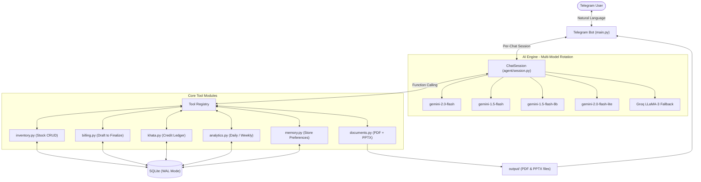

# 🛒 Nebula Kirana Store — AI Operations Manager

> 🤖 **Live Telegram Bot**: [@nebula_store_ops_bot](https://t.me/nebula_store_ops_bot) — *Active & deployed for testing*

An autonomous, multilingual AI operations manager for Indian kirana (grocery) stores, operated entirely through **Telegram**. The store owner chats naturally in any regional language or script — Hindi, Tamil, Tanglish, Telugu, Kannada, Malayalam, Marathi, Bengali, or English — to manage billing, inventory, customer credit (Khata), GST-compliant invoices, and PowerPoint sales decks end-to-end.

---

## 🌟 Key Capabilities

| # | Feature | Details |
|---|---------|---------|
| 1 | **Multilingual & Multimodal** | Handles Tamil, Hindi, Hinglish, Tanglish, Telugu, Kannada, Malayalam, Marathi, Bengali scripts and dialects without code-switching drift |
| 2 | **Deterministic Tool Execution** | Observe → Reason → Act loop with function calling over 20+ typed Python backend tools |
| 3 | **GST Compliance (India)** | Accurate intra-state CGST + SGST split across all 4 slabs (0 %, 5 %, 12 %, 18 %) with HSN code tracking |
| 4 | **Zero-Hallucination Inventory** | Products must be confirmed against SQLite before billing or stock adjustment — no hallucinated items |
| 5 | **Idempotent Multi-Turn Billing** | State-managed draft bills that allow live add/edit/remove with stock deduction only at explicit finalization |
| 6 | **Oversell Guard** | Real-time stock validation before every sale; blocks over-selling with a clear alert |
| 7 | **Customer Khata (Credit Ledger)** | Idempotent credit/payment recording with a 5-minute duplicate-prevention window; `reset_customer_khata` tool available |
| 8 | **Document Generation** | GST PDF invoices (`reportlab`) + 5-slide Food-Market-themed PPTX decks (`python-pptx` + `matplotlib`) sent directly to Telegram |
| 9 | **Multi-Session Store Memory** | Dynamic preference injection (shop name, GSTIN, default payment mode, address, default atta brand) persisted across sessions and `/new` chat resets |
| 10 | **Multi-Model AI Rotation** | Primary: Gemini Flash variants (5-model rotation on 429 / 503); Fallback: Groq LLaMA 3 — zero downtime under rate limits |

---

## 🏛️ System Architecture



---

## 📁 Project Structure

```
nebula_know_lab/
├── main.py                  # Telegram bot entry point & long-polling daemon
├── agent/
│   ├── session.py           # ChatSession: multi-model rotation, tool registry, retry loop
│   └── system_prompt.py     # Dynamic system prompt with store-context injection
├── tools/
│   ├── inventory.py         # search_product, add_product, receive_stock, query_stock,
│   │                        #   list_low_stock, list_all_products
│   ├── billing.py           # start_bill, add_bill_item, remove_bill_item, preview_bill,
│   │                        #   set_bill_payment, finalize_bill, cancel_bill
│   │                        #   (finalized_at stored in local IST, not UTC)
│   ├── khata.py             # add_credit, record_payment, get_khata_balance,
│   │                        #   list_all_khata, reset_customer_khata
│   │                        #   (5-min idempotency window on credit & payment)
│   ├── analytics.py         # daily_close, weekly_summary
│   ├── documents.py         # generate_invoice_pdf (reportlab A4 GST invoice)
│   │                        #   generate_analysis_pptx (5-slide Food Market PPTX)
│   └── memory.py            # set_preference, get_preference, list_preferences
├── db/
│   ├── models.py            # SQLAlchemy ORM: Product, Bill, BillItem, Khata,
│   │                        #   OwnerPreference, StockLog
│   ├── database.py          # Session factory, SQLite WAL + 30 s busy-timeout
│   └── seed.py              # 40+ standard Indian FMCG & grocery items with HSN codes
├── utils/
│   └── gst.py               # GST slab computation (0 / 5 / 12 / 18 %)
├── output/                  # Auto-created; holds generated PDF invoices & PPTX decks
├── Dockerfile               # Container build for VPS / cloud deployment
├── .env                     # API keys and environment variables (not committed)
└── requirements.txt         # Python package dependencies
```

---

## 🛠️ Setup & Installation

### 1. Prerequisites
- Python 3.10+
- Telegram Bot Token — [@BotFather](https://t.me/BotFather)
- Google Gemini API Key — [aistudio.google.com](https://aistudio.google.com) *(primary)*
- Groq API Key — [console.groq.com](https://console.groq.com) *(fallback + voice transcription)*

### 2. Install Dependencies
```bash
pip install -r requirements.txt
```

### 3. Configure Environment (`.env`)
```env
TELEGRAM_BOT_TOKEN=your_telegram_bot_token_here
GEMINI_API_KEY=your_gemini_api_key_here
GROQ_API_KEY=your_groq_api_key_here
DATABASE_URL=sqlite:///nebula_store.db
```

### 4. Run the Bot
```bash
python main.py
```
> The database is created and seeded with 40+ FMCG products automatically on first run.

---

## 💬 Sample Multilingual Interactions

### Inventory & Restocking (Tanglish / Hinglish)
| Turn | Message |
|------|---------|
| **User** | `Maggi stock evlo irukku?` |
| **Bot** | Maggi Noodles 70g: 60 packets (reorder level: 20). மொத்தம் 60 packet உள்ளது. |
| **User** | `Tata Salt 25 packet receive ho gaya` |
| **Bot** | ✅ Stock for Tata Salt 1kg updated → **75 packets** |

### Multi-Item Billing with GST (Hindi)
| Turn | Message |
|------|---------|
| **User** | `सुरेश के लिए 2 Tata Salt और 1 Amul Butter 500g, UPI payment` |
| **Bot** | 🧾 Draft: Salt ×2 ₹44 (0%) + Butter ×1 ₹255 (12%) → Total ₹299. Finalize? |
| **User** | `हाँ, PDF भेजो` |
| **Bot** | ✅ Bill #12 Finalized. 📄 Sending `invoice_12.pdf`… |

### Khata & Credit Ledger (Tamil)
| Turn | Message |
|------|---------|
| **User** | `ரமேஷ் கடன் பாக்கி எவ்வளவு?` |
| **Bot** | ரமேஷின் கடன் பாக்கி ₹200.00. |
| **User** | `ரமேஷ் 100 ரூபாய் திருப்பி செலுத்திவிட்டார்` |
| **Bot** | ✅ Payment recorded. Remaining: ₹100.00 |

---

## 🔒 Reliability & Safety Safeguards

| Safeguard | Implementation |
|-----------|---------------|
| **SQLite WAL Mode** | `PRAGMA journal_mode=WAL` + 30-second busy timeout — prevents write deadlocks under concurrent Telegram messages |
| **Bill Idempotency Keys** | Every finalized bill carries a unique idempotency token — prevents double-billing on network retries |
| **Khata Idempotency** | 5-minute duplicate-prevention window on `add_credit` and `record_payment` — blocks repeated tool calls from accumulating false debt |
| **Oversell Guard** | Stock level validated against DB before every `finalize_bill` — rejects over-selling with a clear warning |
| **Multi-Model Rotation** | Agent rotates across 5 Gemini Flash model variants on HTTP 429 / 503, then falls back to Groq — zero downtime under rate limits |
| **Local Timestamp Storage** | `billing.py` uses `datetime.now()` (local IST) so PPTX revenue charts correctly bucket sales into the right calendar day |
| **Matplotlib Headless Mode** | `matplotlib.use("Agg")` set before chart generation to prevent GUI thread crashes in headless server environments |

---

## 📊 PPTX Analysis Deck — Slide Structure

The generated `analysis_weekly_YYYY-MM-DD.pptx` follows a **Food Market** premium theme:

| Slide | Title | Content |
|-------|-------|---------|
| 1 | Cover | Shop name, period, GSTIN, generation timestamp |
| 2 | Revenue Run-rate | Daily bar chart (highlighted peak day), total revenue, avg bill value |
| 3 | Top Products & Payment Mix | Horizontal bar chart of top 7 SKUs + donut chart of UPI/Cash/Card split |
| 4 | Inventory Diagnostics | Low-stock items table with quantity vs reorder level |
| 5 | Executive Dashboard | KPI summary: bills count, total GST collected, peak sales day, business health score |

---

## 🚀 Deployment

### Docker
```dockerfile
FROM python:3.11-slim
WORKDIR /app
COPY requirements.txt .
RUN pip install --no-cache-dir -r requirements.txt
COPY . .
CMD ["python", "main.py"]
```

```bash
docker build -t nebula-bot .
docker run -d --env-file .env \
  -v $(pwd)/nebula_store.db:/app/nebula_store.db \
  -v $(pwd)/output:/app/output \
  nebula-bot
```

### VPS (systemd service)
```ini
[Unit]
Description=Nebula Kirana AI Bot
After=network.target

[Service]
WorkingDirectory=/opt/nebula_know_lab
ExecStart=/usr/bin/python3 main.py
Restart=always
EnvironmentFile=/opt/nebula_know_lab/.env

[Install]
WantedBy=multi-user.target
```

---

## 📦 Dependencies

| Package | Purpose |
|---------|---------|
| `google-genai` | Gemini Flash API (primary AI engine) |
| `groq` | Groq LLaMA-3 fallback + Whisper voice transcription |
| `python-telegram-bot` | Telegram long-polling bot framework |
| `sqlalchemy` | ORM for SQLite with WAL concurrency |
| `reportlab` | GST-compliant A4 PDF invoice generation |
| `python-pptx` | PowerPoint sales deck generation |
| `matplotlib` | Revenue & product charts embedded in PPTX |
| `python-dotenv` | `.env` file loading |
| `aiofiles` | Async file I/O for Telegram document uploads |
